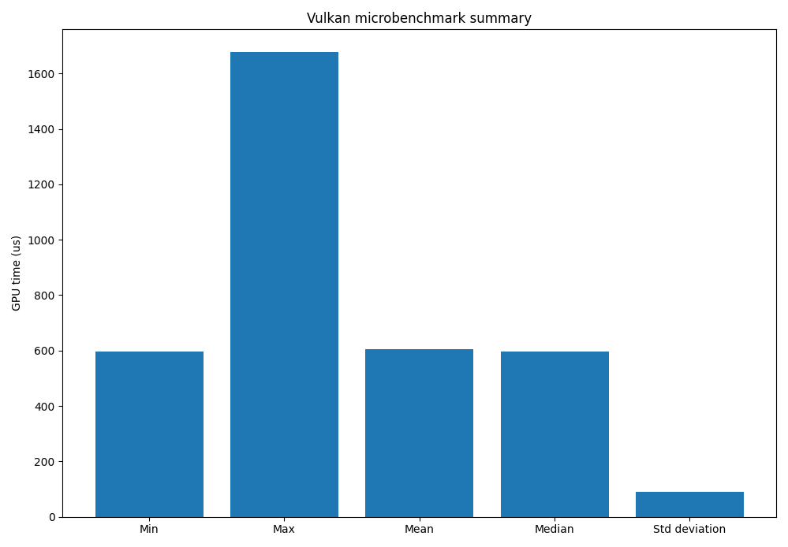

# Vulkan Microbenchmark

This project is a simple GPU microbenchmark built with Vulkan. 
It measures execution time of a compute shader using timestamp queries.

You may download the executable and run it directly without recompiling. However, if you want to change something, you would need to download the Vulkan SDK

The goal is to provide a minimal setup for running repeatable GPU timing experiments.

---

## How it works

- A compute shader is dispatched on the GPU
- Vulkan timestamp queries measure execution time
- The result is printed to stdout: GPU time: x us
- A Python script runs the executable multiple times
- Results are collected, stored, and analyzed using NumPy
- A summary plot is generated

---

## Running the benchmark

Compile the shader code:
- glslc shaders/compute_shader.comp -o shaders/compute_shader.comp.spv  

Build the project using CMake:
- cmake -S . -B build
- cmake --build build --config Debug

Run the Python script:
- python scripts/run_microbenchmark.py

---

## Output

The script produces:

- Raw data:  
  `data/Benchmark_01_complete_test_list.txt`  
  (one run per line)

- Plot:  
  `data/Benchmark_01_results.png`

---

## Example result

BENCHMARK SUMMARY:

- Lowest time: 595.168 us
- Highest time: 1676.220 us
- Mean time: 605.893 us
- Median time: 596.128 us
- Standard deviation: 90.981 us

---

## Notes

- Warmup runs are used to stabilize measurements
- Results may vary depending on GPU, drivers, and system load
- This is intended as a minimal benchmarking framework, not a full profiling tool

## Detailed Information

- **Device selection**  
The program prefers a discrete GPU if one is available. If not, it falls back to any available physical device that supports compute operations. This ensures the benchmark runs on the most performant hardware by default.

- **Queue selection**  
A queue family supporting compute operations is selected. This is required for dispatching the compute shader workload.

- **Workload**  
The benchmark uses a compute shader with a configurable loop workload. The total number of threads is defined by the dispatch size and local workgroup size. Changes to loop iterations or dispatch dimensions affect the measured execution time.

- **Memory usage**  
A storage buffer is allocated in device-local memory. This ensures the GPU operates on fast memory without unnecessary CPU-GPU transfers during execution.

- **Descriptor sets**  
The buffer is bound to the shader using a descriptor set. This is the mechanism Vulkan uses to pass resources (like buffers) to shaders.

- **Pipeline setup**  
A compute pipeline is created using the compiled SPIR-V shader. Shader modules are only needed during pipeline creation and are destroyed afterward.

- **Timing method**  
GPU execution time is measured using Vulkan timestamp queries:
- A timestamp is written before dispatch
- A timestamp is written after dispatch  
The difference between these timestamps gives the GPU execution time in microseconds

- **Synchronization**  
A fence is used to ensure the GPU has completed execution before reading timing results. This guarantees valid and consistent measurements.

- **Warmup runs**  
Initial runs are discarded to reduce the impact of:
- pipeline creation overhead
- driver initialization
- shader caching

- **Measurement runs**  
The benchmark is executed multiple times to collect stable data. Results are stored and analyzed statistically.

- **Data processing**  
Results are processed using NumPy to compute:
- mean
- median
- minimum
- maximum
- standard deviation

- **Output format**  
Raw data is stored as plain text with one measurement per line.  
A summary plot is generated showing key statistics.

- **Limitations**  
- Results may vary depending on system load and background processes  
- This is a microbenchmark and does not represent full application performance  
- No advanced profiling (e.g., cache effects, memory bandwidth breakdown) is included